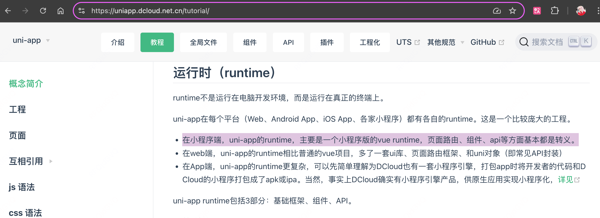
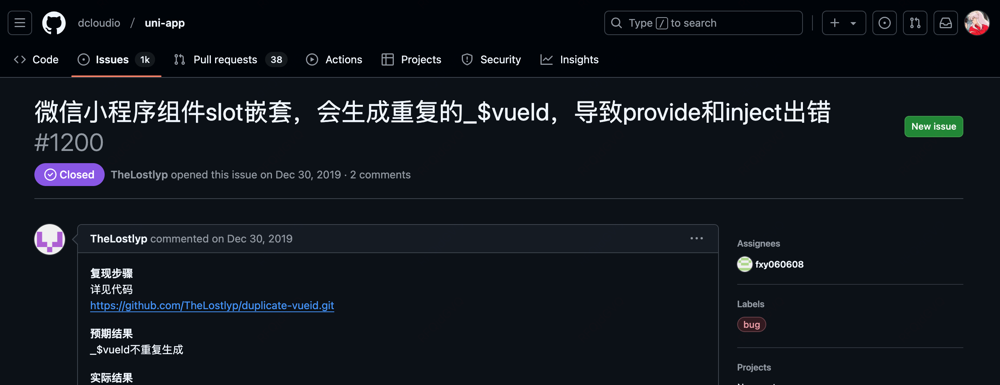
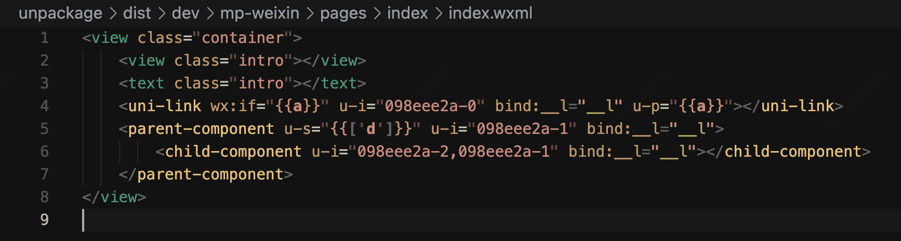
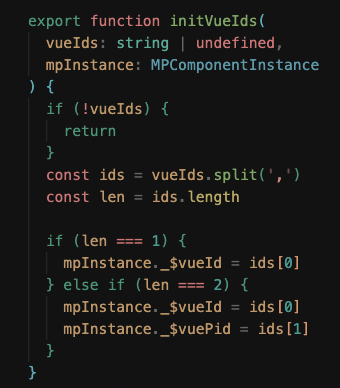
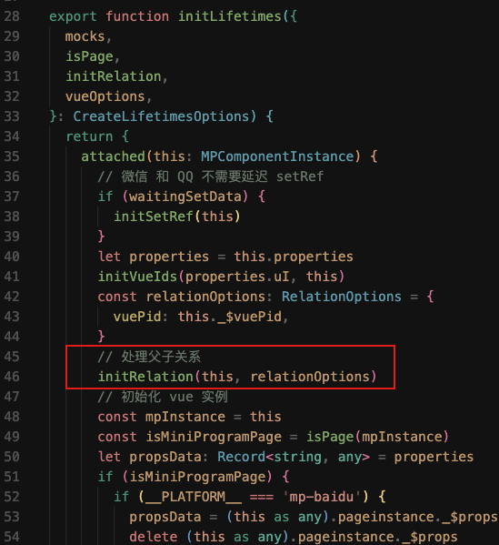
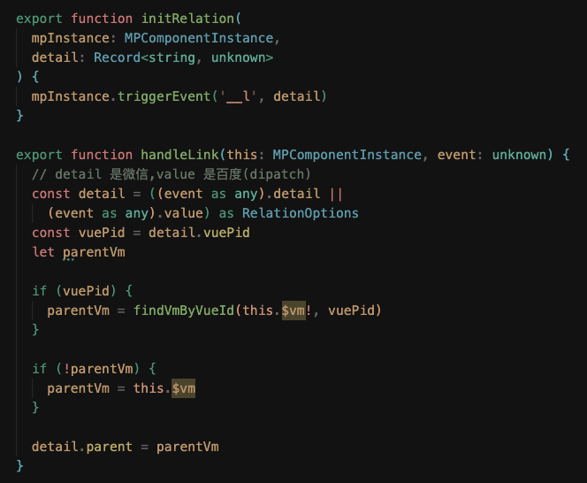

# **Mpx - Provice/Inject**

- 功能介绍

- Mpx、Vue 实现原理

- 跨端框架延伸

<style>
h1 {
  line-height: 5em;
  background: linear-gradient(315deg, #42d392 25%, #647eff);
  background-size: 100%;
  -webkit-background-clip: text;
  -moz-background-clip: text;
  -webkit-text-fill-color: transparent;
  -moz-text-fill-color: transparent;
}
</style>

---
layout: center
---

#

<a href="https://mpxjs.cn/guide/advance/provide-inject.html" target="_blank">Mpx 文档</a>

---
theme: seriph
---

## Vue 实现原理
<br>

<div style="display: inline;" v-click> 🤔 在 Vue 中，我们能获取到当前组件的父组件实例 <br/> </div>
<br>

<div v-click> 1. 找到父组件 </div>
<div v-click> 2. 检查父组件是否提供 </div>
<div v-click> 3. 没有，继续检查父组件的父组件是否提供 </div>
<div v-click> 4. 继续向上查找，直到找到为止 </div>

---
theme: seriph
---

## Vue 实现原理
<br>

````md magic-move
```ts{1-11}
// 冒泡递归查找？ O(N)

export function resolveProvided(vm: Component): Record<string, any> {
  while (vm.$parent) {
    vm = vm.$parent
    if (vm._provided) {
      return vm._provided
    }
  }
  return Object.create(null)
}

export function provide<T>(key: InjectionKey<T> | string | number, value: T) {
  // ..
  resolveProvided(currentInstance)[key as string] = value
}
```

```ts{1-11|7}
// 基于父组件的原型继承实现 O(1)

export function resolveProvided(vm: Component): Record<string, any> {
  const existing = vm._provided
  const parentProvides = vm.$paren?._provided
  if (parentProvides === existing) {
    return (vm._provided = Object.create(parentProvides))
  } else {
    return existing
  }
}

export function provide<T>(key: InjectionKey<T> | string | number, value: T) {
  // ..
  resolveProvided(currentInstance)[key as string] = value
}
```
````

---
layout: two-cols
---

## Vue 实现原理
<br>

```ts{4,6}
// 基于父组件的原型继承实现

export function resolveProvided(vm: Component): Record<string, any> {
  const existing = vm._provided
  const parentProvides = vm.$paren?._provided
  if (parentProvides === existing) {
    return (vm._provided = Object.create(parentProvides))
  } else {
    return existing
  }
}
```

::right::

<div style="padding-left: 1em;">

```ts{none|all|11}
// 初始化

export function initLifecycle(vm: Component) {
  const options = vm.$options
  let parent = options.parent
  // ..
  vm.$parent = parent
  vm.$root = parent ? parent.$root : vm
  vm.$children = []
  vm.$refs = {}
  vm._provided = parent ? parent._provided : Object.create(null)
  vm._watcher = null
  vm._inactive = null
  vm._directInactive = false
  vm._isMounted = false
  vm._isDestroyed = false
  vm._isBeingDestroyed = false
}
```
</div>

---

### Mpx 实现原理
<br>

```ts{all|5,10,16}
// 基于页面维度的“降级模拟”

function resolvePageId (context) {
  if (context && isFunction(context.getPageId)) {
    return context.getPageId()
  }
}

function resolvePageProvides (context) {
  const pageId = resolvePageId(context)
  return providesMap.__pages[pageId] || (providesMap.__pages[pageId] = Object.create(null))
}

export function provide (key, value) {
  // ..
  const provides = resolvePageProvides(instance.target)
  provides[key] = value
}
```

---

### Mpx 实现原理
<br>

降级模拟的原因：小程序没有提供获取父组件实例的相关原生方法

<div v-click>
  
  - 尝试过：小程序的 [组件间关系 relations](https://developers.weixin.qq.com/miniprogram/dev/framework/custom-component/relations.html) 机制 🙅

    - 测试发现 relations 更像是通过 wxml “静态分析” 来关联同一组件内的组件间关系，而且无法满足跨组件场景
</div>
<br>
<br>
<br>
<br>
<br>
<div v-click> 🤔 那其他框架是如何实现的呢？</div>

---
layout: two-cols
---

### Vue 父子组件关系的实现
<br>

```ts{none|all|13-16}
// src/core/vdom/create-component.ts
const componentVNodeHooks = {
  init(vnode: VNodeWithData, hydrating: boolean): boolean | void {
    if (
      vnode.componentInstance &&
      !vnode.componentInstance._isDestroyed &&
      vnode.data.keepAlive
    ) {
      // kept-alive components, treat as a patch
      const mountedNode: any = vnode // work around flow
      componentVNodeHooks.prepatch(mountedNode, mountedNode)
    } else {
      const child = (vnode.componentInstance = createComponentInstanceForVnode(
        vnode,
        activeInstance
      ))
      child.$mount(hydrating ? vnode.elm : undefined, hydrating)
    }
  }
  // ..
}
```

::right::

<div style="padding-left: 1em;margin-top: -1em;">
```ts{none|all|2,5}
// src/core/instance/lifecycle.ts
export let activeInstance: any = null
export function setActiveInstance(vm: Component) {
  const prevActiveInstance = activeInstance
  activeInstance = vm
  return () => {
    activeInstance = prevActiveInstance
  }
}
```
</div>

<div style="padding-left: 1em;padding-top: 0.5em;">
```ts{none|all|4,9,16}
// src/core/vdom/create-component.ts
export function createComponentInstanceForVnode(
  vnode: any,
  parent?: any // activeInstance in lifecycle state
): Component {
  const options: InternalComponentOptions = {
    _isComponent: true,
    _parentVnode: vnode,
    parent
  }
  const inlineTemplate = vnode.data.inlineTemplate
  if (isDef(inlineTemplate)) {
    options.render = inlineTemplate.render
    options.staticRenderFns = inlineTemplate.staticRenderFns
  }
  return new vnode.componentOptions.Ctor(options)
}
```
</div>

---

### 类 Vue 的小程序跨端框架

- uniapp
- taro-vue
- mpvue
- ..

<div v-click>
  <br>
  
</div>

---

### uni-app 揭秘
<br>

- 特定事件响应
- vueId hash标识



---

### uni-app 揭秘
<br>



---

### uni-app 揭秘
<br>







---
layout: center
---

<!-- ### Thanks -->

<div class="w-60 relative">
  <div class="relative w-40 h-40">
    
    
    
  </div>

  <div
    class="text-1xl absolute top-14 left-40 text-[#2B90B6] -z-1"
    v-motion
    :initial="{ x: -80, opacity: 0}"
    :enter="{ x: 0, opacity: 1, transition: { delay: 2000, duration: 1000 } }"
  >
    Thanks! Powered by <a href="http:/cn.sli.dev" target="_blank">Slidev</a>
  </div>
</div>

<!-- vue script setup scripts can be directly used in markdown, and will only affects current page -->
<script setup lang="ts">
const final = {
  x: 0,
  y: 0,
  rotate: 0,
  scale: 1,
  transition: {
    type: 'spring',
    damping: 10,
    stiffness: 20,
    mass: 2
  }
}
</script>

<div
  v-motion
  :initial="{ x:35, y: 30, opacity: 0}"
  :enter="{ y: 0, opacity: 1, transition: { delay: 3500 } }">
</div>